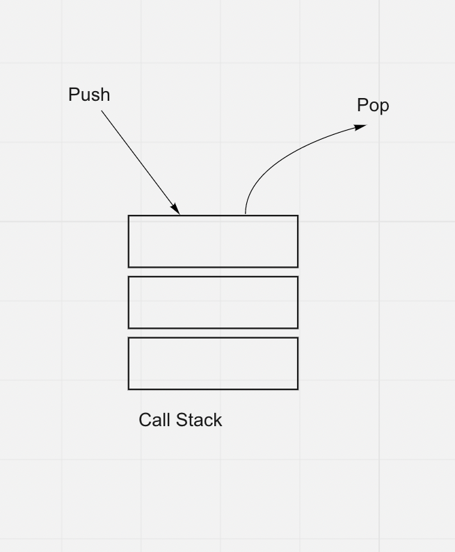

# Readings: In memory storage

## Understanding the JavaScript Call Stack

https://www.freecodecamp.org/news/understanding-the-javascript-call-stack-861e41ae61d4/

### 1. What is a ‘call’?

A call refers to the invocation of a function (CALLing a function).

### 2. How many ‘calls’ can happen at once?

One call. This means that the call stack is synchronous.

### 3. What does LIFO mean?

Last In First Out

### 4. Draw an example of a call stack and the functions that would need to be invoked to generate that call stack.

### 5. What causes a Stack Overflow?

A stack overflow occurs when a function recursively calls itself without an exit point. It is the name of the erro when the number of calls on the call stack reaches the stacks maximum size limit.

## JavaScript error messages

https://codeburst.io/javascript-error-messages-debugging-d23f84f0ae7c

### 1. What is a ‘refrence error’?

A attempt to use a variable that has not yet been declared.

### 2. What is a ‘syntax error’?

Syntax cannot be parsed.

### 3. What is a ‘range error’?

Attempt to mutate and object's length to an invalid value.

### 4. What is a ‘type error’?

Attempt to operate on objects whose type is ibompatible with the operation.

### 5. What is a breakpoint?

A breakpoint is a debugger tool that allows a dev to stop code execution at a desired line.

### 6. What does the word ‘debugger’ do in your code?

It inserts a breakpoint directly into the code.

## Things I want to know more about

Using the debugger.
